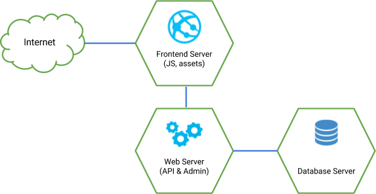

# Ticketing System

## Introduction

The purpose of this assignment is to evaluate the candidate and apprentice designing and development abilities.
We expect the code published on public [Github](http://github.com/) or [Bitbucket](https://bitbucket.org/) repository.
You can use any technology you feel proficient with. We propose using [Django](https://www.djangoproject.com/) for the Backend, [React](https://reactjs.org/) for the frontend, and [PostgreSQL](http://postgresql.org/) for the database.

## Project information

This project consist in building a web based ticketing system, where users can upload tickets and distribute work among project teammates. The system manages two types of entities: Users and Tickets. For the users the system knows about, their email, their password, which should be stored securely in the database and their full name. For the tickets the system stores their title, the description, it's status (which can be either *open* or *closed*), the creation date. Also, for each ticket the system stores the Author and the Assignee both of them are User entities.

### Registration and approval
Users have to request to register to the site. Upon request, a system administrator have to approve their request for them to use the site.

### Dashboard and ticket management

When the user log in they are redirected to their Dashboard, which shows a list of tickets assigned to that user. Tickets can be created, edited, closed or assigned to another user. If the ticket is closed, it will no longer appear in the dashboard by default. If the ticket is assigned, it will show only to the assigned user. The dashboard will allow showing all tickets including closed ones.

## Pages

We propose a site structure the picture below, having a separate site for using the Ticket system, and another special page for administrators for the purpose of approving users.

You can adapt the schema, as long as the site provides following pages:

- Register Page, where users can register. They have to wait until an administrator authorizes them to enter again.
- Login page to enter the Dashboard
- Dashboard page containing a ticket list and
 - Filters: by title and status
 - Individual actions: Create a ticket, edit a ticket, and delete a ticket
- Ticket creation page, where the user can enter the following information
 - Title, body, status and assignee are editable.
 - Status is open by default.
 - Creation date is read only and set to the browser date.
 - Author is read only and is set to the logged in user.
 - Assignee is the logged in user by default but you can change it selecting from a list of users.
- Ticket details page, where the user can see and edit the ticket status, body and title.

### Hints

* If you use Django, you can use the built in [Admin site](https://docs.djangoproject.com/en/2.0/ref/contrib/admin/) page for implementing this in another framework consider using an Admin Site for this instead of crafting a page specifically for this.
* The landing page can have a log in form included instead of a dedicated login page.

## Optional Requirements

If you feel so, you have time consider doing the following activities.

### Code Quality
- Use Sophilabs' *[guidelines](https://sophilabs.co/guidelines/)* to improve the code.
- *[Unit Test](https://en.wikipedia.org/wiki/Unit_testing)* coverage above 90% both frontend and backend.

### Deployment

- Use [containerization](https://en.wikipedia.org/wiki/Operating-system-level_virtualization) through [Docker](https://www.docker.com/) to isolate your web server and database.
 
 A good starting point can be having 3 containers:
 * A Frontend Server, which hosts a [Single Page Application](https://www.kirupa.com/react/creating_single_page_app_react_using_react_router.htm) and makes calls to a Backend Server to do any operation with the system.
 * A Backend Server, which exposes an API for operating with the system. It can contain the Admin Site to approve users.
 * A Database Server to store persistent data, using PostgreSQL or another database engine of your choice.
- *Deploy* your project to be available publicly on [Amazon Web Services](http://aws.amazon.com/), [Heroku](https://www.heroku.com/) or a similar service.

**Good luck!**

